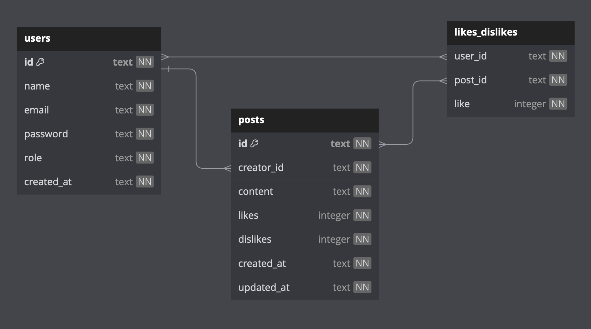

# Projeto Labook - Backend

### Documentação da API

https://documenter.getpostman.com/view/30031982/2sA2xpS9Ei

## Descrição do projeto

O Labook é uma API de rede social criada com o objetivo de promover a conexão e interação entre pessoas. Após realizar o cadastro e fazer o login na plataforma, os usuários da rede poderão criar e gerenciar postagens, bem como poderão dar like ou dislike nas publicações dos demais usuários.

## Tecnologias e conteúdos abordados
- NodeJS
- Typescript
- Express
- SQL e SQLite
- Knex
- POO
- Arquitetura em camadas
- Erros customizados
- Design Patterns e DTO - Zod (schema validator)
- Geração de UUID
- Geração de hashes
- Autenticação e autorização
- Roteamento
- Postman

## Recursos da API

- **Cadastro de Usuários**: Para poder interagir na rede social Labook, o usuário pode criar sua conta fornecendo informações pessoais básicas como **nome**, **email** e **senha**.

- **Criação e Gerenciamento de Postagens**: Após realizarem o cadastro e o login na plataforma, os membros do Labook já podem fazer suas postagens, compartilhando suas ideias e momentos. Os membros possuem controle total sobre suas postagens, podendo editá-las ou excluí-las a qualquer momento.

- **Likes e Dislikes**: Os usuários podem dar **like** ou **deslike** nas postagens de outros membros, possibilitando uma melhor mensuração da qualidade (positiva ou negativa) do conteúdo compartilhado.

- **Recursos de Segurança**: Visando garantir a segurança e a privacidade dos usuários, o Labook pussui medidas de segurança como, senhas criptografadas, e também autenticação por meio de tokens JWT.

## Banco de dados

Clique [aqui](https://dbdiagram.io/d/63d16443296d97641d7c1ae1) para conferir o site com a estrutura do banco de dados.

## Lista de requisitos do projeto

- Documentação no Postman de todos os endpoints

- Endpoints
    - [ ]  signup
    - [ ]  login
    - [ ]  create post
    - [ ]  get posts
    - [ ]  edit post
    - [ ]  delete post
    - [ ]  like / dislike post

- Autenticação e autorização
    - [ ]  identificação UUID
    - [ ]  senhas hasheadas com Bcrypt
    - [ ]  tokens JWT
 
 - Código
    - [ ]  POO
    - [ ]  Arquitetura em camadas
    - [ ]  Roteadores no Express

- README.md

## Desenvolvedor

Este projeto foi desenvolvido por:

**Leonardo Canone** : [LinkedIn](https://www.linkedin.com/in/leonardocanone/) | [GitHub](https://github.com/leonardocanone)

